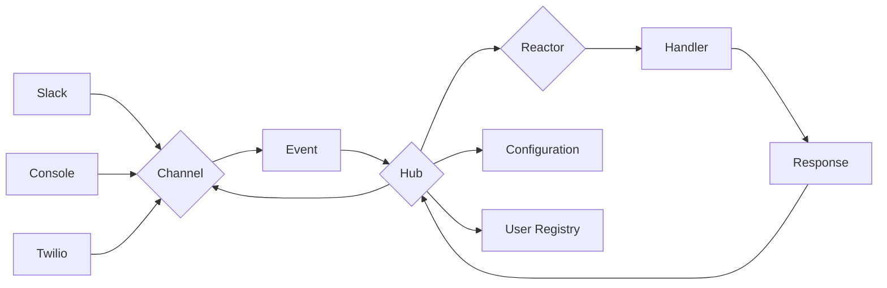

# Igor

## 1. Introduction

### 1.1 Purpose

Igor is an event-driven multi-channel bot framework that allows users to send
and recieve messages to and from various platforms (e.g. Discord, the console,
WhatsApp, Twilio). The purpose of this document is to provide a technical
overview of Igor's architecture, components, and functionality.

### 1.2 Scope

The scope of this document covers the high-level design of Igor, including its
main components (Hub, Channels, Events, and Reactors), their responsibilities,
and interactions. It also outlines the project structure and provides guidance
on building and testing the application.

## 2. System Architecture

### 2.1 Overview

Igor consists of the the following main components:

- Hub: The central coordinator of the application, managing channels, reactors,
  and global configuration.
- Channels: Interfaces for different communication platforms (Slack, Console,
  Twilio).
- Events: A common format for communication between channels and the hub.
- Reactors: Response handlers for events, containing the logic for processing
  and replying to messages.

### 2.2 Component Interaction

1. The Hub initializes and manages the lifecycle of Channels and Reactors.
2. Channels listen for incoming messages from their respective platforms and
   transform them into Events.
3. The Hub receives Events from Channels and queries Reactors to determine if
   they should respond.
4. Reactors evaluate the Events and execute their handling logic, which may
   involve sending a reply, performing an action, or triggering another process.
5. Channels send the Reactors' response back to the user through the appropriate
   platform.

## 3. Detailed Component Design

### 3.1 Hub

The Hub is a class that holds the global config and
manages the Channels and Reactors.

### 3.2 Channels

Channels are subclasses implementing a common interface for different
communication platforms. They handle the input and output of messages specific
to each platform.

They are responsible for:

- Connection management: Establish and maintain a connection with the respective
  platform.
- Message listening: Continuously listen for incoming messages from the
  platform.
- Message parsing: Convert invoming messages into a standardized format
  (Events), that the rest of the application can understand.
- Message sending: Send messages to the platform, typically as a response to an
  incoming message or a proactive message from the bot.
- Error handling; Manage any connection errors or issues with the platform's
  API.

### 3.3 Events

Events are instances of a common Event class, used by Channels to communicate
with the Hub. They encapsulate all necessary information about an event (sender,
message content, etc).

### 3.4 Reactors

Reactors are classes with predicates to determine if and how they should respond
to a given Event, and handlers to process the Event.

They are responsible for:

- Event Evaluation: Determine whether a particular event (message) should
  trigger the reactor.
- Handling Logic: Contain the logic for what to do when an event triggers the
  reactor. This could involve sending a reply, performing an action, or triggering
  another process.
- State Management: Maintain any necessary state or context needed for
  decision-making or responding to events.
- Interaction with External Services: In some cases, reactors may need to
  interact with databases, APIs, or other external services to process an event.

## 4. Functionality

Igor will support the following commands and features:

- "igor echo": Mainly for testing
- "igor cat pic": Retrieves a cat pic from thecatapi
- "igor song": Retrieve and display song information
- "igor airwatch": Retrieve and display airwatch data
- "igor weather": Retrieve and display weather information
- "igor toggl start/stop": Start or stop time tracking in Toggl
- "igor fortune": Display a random fortune
- "igor remind me {in, at, on} {TIME or DURATION}: {REMINDER TEXT}": Set a reminder and send an email at the specified time
- "igor agenda": Display a list of upcoming reminders
- "igor xkcd": Daily xkcd comic strip retrieval
